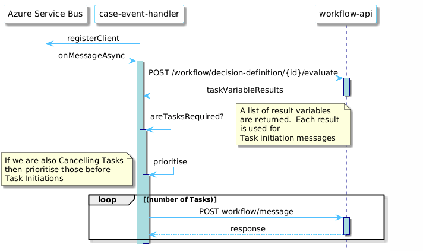

# wa-case-event-handler

[](https://github.com/hmcts/wa-case-event-handler)

[](https://opensource.org/licenses/MIT)

Last reviewed on: **17/04/2025**
## Overview

`wa-case-event-handler` is a Spring Boot application designed to handle case events and execute schedule jobs on messages. It uses Gradle as its build tool and supports JUnit 5 for testing.
End point used to process messages from CCD is /messages in CaseEventHandlerController which is used to initiate/reconfigure/cancel tasks.
<!--
    Sequence Diagram Source:
    https://www.plantuml.com/plantuml/uml/XPB1RXCn48RFdQSObGiSGivmWAOjI9MAgDgA-yIUpOxMyInZEqkf-kvuatRfHaYizkJv_8r_ZyzI9ijb6w0LpzYevhN-0aYTn9wCjfXQyZf8t62smhCA_omS7UCZdApCTBZGe8QNpFrTzt0U2jTrbzNErJpReUh9klM-T2qDNqla_rJ9THlJ4ls1UBFwS7bn-HLEuEI6B8kJdcAU7FF-C-RODBII6V3v-yOfqOPNGJOH7SVC1ay0MN9WlAVKuLMKB9H58q3_Lukdgz_56E_OTk8OpqiwHKhrNyynHuaNlAlgHKlH1xOzvxYTSuDQrmGT5jJBdXW8e5Au-3HAyICQRoJbcZT8jG5GoKekouuoeqQeL8L7SuKrlaHB3z5Dfe5gxURxtJqkNnekFJj9DT_2SoDZMetBH_5FIzvHA5KEKBSj9dMcrFqW4re7lkLKGau7_qIGyNXtwRO-5J7sdo5gPZJPj1bM66eCr0Pjlnbtpww4G5OfpiKY-_U8NyYrBnH8mfBOOwC6enrbcWnk3raJSFGuzZewK6-YLkd4S3XAu2R3LOC3uzYJGbAyeEWuXF7DZ_u4kUNuQYlcLXFZcXirHZXw7Qzx1zKUtyQoNRFLe0VTktyCOPh1Su3vHHkdleePHZM0vsdQjGvdTR5imny0
    See: https://plantuml.com/ docs for reference
-->

---

## Notes

- Since **Spring Boot 2.1**: bean overriding is disabled by default. To enable it, set the following property:
  ```properties
  spring.main.allow-bean-definition-overriding=true

 JUnit 5 is now enabled by default in the project. Please refrain from using JUnit4 and use the next generation

## Building and deploying the application

### Building the application

The project uses [Gradle](https://gradle.org) as a build tool. It already contains
`./gradlew` wrapper script, so there's no need to install gradle.

Prerequisites
1. Ensure all services are running in Minikube. Follow the instructions in the wa-kube-environment repository.
2. Check if the Idam simulator is set as an environment variable:
   ```bash
   echo $OPEN_ID_IDAM_URL
   ```
   You should see `http://sidam-simulator/` as output. If not, source the environment variables:
   ```bash
   source .env
   ```
3. Make sure the BPMN and DMN are deployed onto Camunda locally. Workflow and Task management api services should be running

**Building the Application**

To build the project execute the following command:

```bash
  ./gradlew build
```

### Running the application

- You can either run as Java Application from run configurations or
    ```bash
      ./gradlew clean bootRun
    ```
- In order to test if the application is up, you can call its health endpoint:

    ```bash
      curl http://localhost:8088/health
    ```

  You should get a response similar to this:

    ```
  {
   {
    "status":"UP",
    "components":{
     "caseEventHandlerLivenessHealthController":{"status":"UP"},
     "caseEventHandlerReadinessHealthController":{"status":"UP"},
     "ccdMessagesInNewState":{"status":"UP","details":{"caseEventHandlerMessageStateHealth":"check disabled in local-arm-arch"}},
     "ccdMessagesReceived":{"status":"UP","details":{"caseEventHandlerMessageHealth":"check disabled in local-arm-arch"}},
     "coreCaseData":{"status":"UP"},"db":{"status":"UP","details":{"database":"PostgreSQL","validationQuery":"isValid()"}},
     "discoveryComposite":{"description":"Discovery Client not initialized","status":"UNKNOWN","components":{"discoveryClient":{"description":"Discovery Client not initialized","status":"UNKNOWN"}}
   },
    "diskSpace":{"status":"UP","details":{"total":994662584320,"free":306118062080,"threshold":10485760,"path":"<project_path>/.","exists":true}},
    "livenessState":{"status":"UP"},
    "ping":{"status":"UP"},
    "readinessState":{"status":"UP"},
    "refreshScope":{"status":"UP"},
    "serviceAuth":{"status":"UP"}},
    "groups":["liveness","readiness"]}
  }
  ```
**Running Tests**
- To run all all tests, you can run the command
    ```bash
      ./gradlew test integration functional
    ```
  Alternatively, you can run the command
    ```bash
      ./gradlew tests
    ```

- To run all tests including junit, integration and functional.
  NOTE: This service is dependent on wa-workflow-api and wa-task-configuration service , so make sure it is running locally when running FTs.

  You can run the command
   ```
       ./gradlew test integration functional
   ```
  or
  ```
  ./gradlew tests
  ```

### Configuration for functional test
- To run functional tests, application should connect to the ASB. Make sure you have ASB subscription and provide
  correct values for these environment variables before you start the application.
  ```
  export AZURE_SERVICE_BUS_CONNECTION_STRING="Endpoint=sb://ccd-servicebus-demo.servicebus.windows.net/;SharedAccessKeyName=SendAndRecieveCCDMessage;SharedAccessKey=<Access_Key>;EntityPath=wa-case-event-handler-topic-sessions-ft"
  export AZURE_SERVICE_BUS_TOPIC_NAME=wa-case-event-handler-topic-sessions-ft
  export AZURE_SERVICE_BUS_CCD_CASE_EVENTS_SUBSCRIPTION_NAME=<subscription_name>
  export AZURE_SERVICE_BUS_MESSAGE_AUTHOR=<author_name>
  ```

- To run application please provide these values
  ```
  export AZURE_SERVICE_BUS_DLQ_FEATURE_TOGGLE=true
  ```
- Example command to run Application
  ```
  AZURE_SERVICE_BUS_CONNECTION_STRING="Endpoint=sb://ccd-servicebus-demo.servicebus.windows.net/;SharedAccessKeyName=SendAndRecieveCCDMessage;SharedAccessKey=<Access_Key> \
  AZURE_SERVICE_BUS_DLQ_FEATURE_TOGGLE=true \
  POSTGRES_HOST=ccd-shared-database \
  ./gradlew clean bootrun
  ```
- To run functional tests, make sure Application is up and running.
- please provide these values
- ```
  export AZURE_SERVICE_BUS_DLQ_FEATURE_TOGGLE=false
  ```
- Functional tests send messages to CaseEventHandlerTestingController, we are not using ASB for messaging.
  However, MessageReadinessConsumer peek into the ASB DLQ to make sure DLQ is empty before setting any message READY to
  be processed. So we still need to connect the application to the ASB.
  Functional test context doesn't need any of the ASB configuration as tests do not connect to the ASB


- Example command to run Functional Tests
  ```
  AZURE_SERVICE_BUS_CONNECTION_STRING="Endpoint=sb://ccd-servicebus-demo.servicebus.windows.net/;SharedAccessKeyName=SendAndRecieveCCDMessage;SharedAccessKey=<Access_Key> \
  AZURE_SERVICE_BUS_DLQ_FEATURE_TOGGLE=false \
  ./gradlew clean functional
  ```
